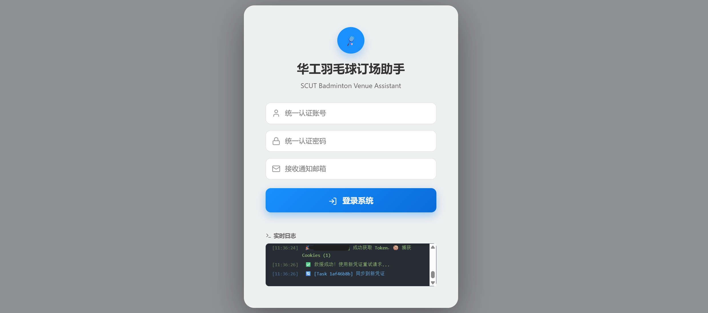

# 华工羽毛球订场系统 (SCUT Badminton Auto-Order System)

基于 FastAPI (后端) 和 React (前端) 的华工羽毛球场自动订场系统。

## 📸 界面预览



## ✨ 主要特性

- **智能登录**：自动识别2FA验证、Session复用、Token自动救援
- **订场模式**：狙击抢票、无限锁场（基于精确时间点的续订机制）
- **安全稳定**：白名单控制、僵尸进程清理、邮件通知

---

## 🛠️ 服务器部署教程（小白友好版）

### 📦 需要上传的文件清单

```
scut_new/
├── main.py              # 主程序入口
├── core.py              # 核心功能模块
├── monthly_booking.py   # 月场预订模块
├── celery_worker.py     # Celery 异步任务
├── requirements.txt     # Python 依赖
├── allowed_users.txt    # 白名单（每行一个学号）
├── .env.production      # 生产环境配置
├── scut-api.service     # systemd 服务文件
├── scut-worker.service  # Celery worker 服务文件
├── dist/                # 前端构建产物（整个目录）
│   ├── index.html
│   └── assets/
└── assets/              # 静态资源（可选）
```

### 第一步：服务器环境安装

```bash
# 1. 更新系统
sudo apt update && sudo apt upgrade -y

# 2. 安装 Python 3 和 pip
sudo apt install python3 python3-pip python3-venv -y

# 3. 安装 Redis（用于任务队列和缓存）
sudo apt install redis-server -y
sudo systemctl enable redis-server
sudo systemctl start redis-server

# 4. 安装 Chrome 浏览器
wget -q -O - https://dl.google.com/linux/linux_signing_key.pub | sudo apt-key add -
echo "deb [arch=amd64] http://dl.google.com/linux/chrome/deb/ stable main" | sudo tee /etc/apt/sources.list.d/google-chrome.list
sudo apt update
sudo apt install google-chrome-stable -y

# 5. 安装 Chrome 依赖库
sudo apt install -y libnss3 libgconf-2-4 libxss1 libasound2 libatk1.0-0 libgtk-3-0

# 6. 安装 Node.js（仅在需要本地构建前端时）
curl -fsSL https://deb.nodesource.com/setup_20.x | sudo -E bash -
sudo apt install -y nodejs
```

### 第二步：创建项目目录

```bash
# 创建目录
sudo mkdir -p /var/www/scut_new
cd /var/www/scut_new

# 创建 Python 虚拟环境
python3 -m venv venv
source venv/bin/activate
```

### 第三步：上传文件

使用 FTP/SFTP 工具（如 FileZilla）将以下文件上传到 `/var/www/scut_new/`：

| 文件 | 必须 | 说明 |
|-----|:---:|------|
| `main.py` | ✅ | 主程序 |
| `core.py` | ✅ | 核心模块 |
| `monthly_booking.py` | ✅ | 月场模块 |
| `celery_worker.py` | ✅ | 异步任务 |
| `requirements.txt` | ✅ | Python依赖 |
| `allowed_users.txt` | ✅ | 白名单 |
| `.env.production` | ✅ | 环境配置 |
| `scut-api.service` | ✅ | API服务 |
| `scut-worker.service` | ✅ | Worker服务 |
| `dist/` | ✅ | 前端文件夹 |

### 第四步：安装 Python 依赖

```bash
cd /var/www/scut_new
source venv/bin/activate
pip install -r requirements.txt
```

### 第五步：配置环境变量

```bash
# 复制并编辑配置文件
cp .env.production .env

# 编辑配置（按需修改）
nano .env
```

配置内容示例：
```properties
SCUT_PORT=5003
SCUT_HOST=0.0.0.0
HEADLESS=true
SCUT_ALLOWLIST_FILE=allowed_users.txt
```

### 第六步：配置白名单

```bash
# 编辑白名单文件
nano allowed_users.txt
```

格式（每行一个学号）：
```
202320100334
202320100335
```

### 第七步：安装 systemd 服务

```bash
# 复制服务文件
sudo cp scut-api.service /etc/systemd/system/
sudo cp scut-worker.service /etc/systemd/system/

# 重新加载 systemd
sudo systemctl daemon-reload

# 启用开机自启
sudo systemctl enable scut-api
sudo systemctl enable scut-worker

# 启动服务
sudo systemctl start scut-api
sudo systemctl start scut-worker
```

### 第八步：验证部署

```bash
# 检查服务状态
sudo systemctl status scut-api
sudo systemctl status scut-worker

# 查看实时日志
sudo journalctl -u scut-api -f

# 测试访问（服务器内部）
curl http://localhost:5003/
```

### 常用运维命令

```bash
# 重启服务
sudo systemctl restart scut-api
sudo systemctl restart scut-worker

# 停止服务
sudo systemctl stop scut-api

# 查看日志（最近100行）
sudo journalctl -u scut-api -n 100

# 清理 Chrome 僵尸进程
pkill -9 -f chrome
pkill -9 -f chromedriver
```

---

## � 本地开发

### 环境准备
- Node.js 18+
- Python 3.8+
- Google Chrome

### 前端开发
```bash
npm install
npm run dev
```

### 后端开发
```bash
pip install -r requirements.txt
python main.py
```

### 构建前端
```bash
npm run build
# 产物在 dist/ 目录
```

---

## 📖 使用指南

1. **登录**：输入学号和统一认证密码
2. **普通抢票**：选择日期时间，关闭锁场模式
3. **无限锁场**：开启锁场模式，系统会自动在到期前5秒续订

## ⚠️ 注意事项

- 本项目仅供学习交流
- 锁场模式下请在使用前手动支付或取消
- 服务器部署需确保 Chrome 和相关依赖已安装
